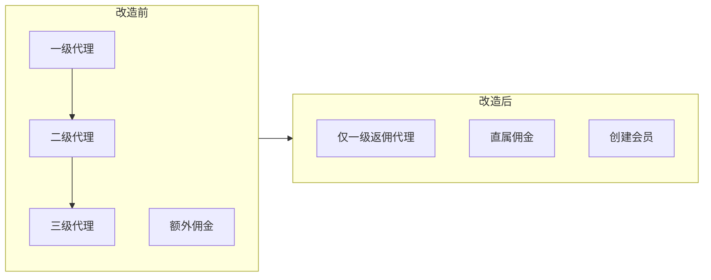

# 返佣代理单层化减法计划

## 产品口径（已确认）

- 返佣代理只有一层（仅一级），不再发展下级代理。
- PC「返佣金设置」：**额外佣金**整块删除，**下级创建开关**一并删除；保留币种 + 当月佣金档位。
- 移动端返佣：**仅保留创建会员**；去掉创建代理 / 邀请现有会员为下级（及相关入口）。
- 「我的佣金」：**只保留直属佣金**；仅一级时 **去掉级次 Tab**。
- **占成（share）路径整段不动**；一级「代理赚水」仍保留（与多级额外佣金无关）。

---

## 一、PC 后台

### 1. 返佣金设置（重点删）

核心文件：

- [src/views/pc/PcAgentCommissionSettingView.vue](src/views/pc/PcAgentCommissionSettingView.vue)
- [src/constants/agentCommissionSetting.ts](src/constants/agentCommissionSetting.ts)
- [src/constants/agentCommissionSettingSpec.ts](src/constants/agentCommissionSettingSpec.ts)
- [src/components/wireframe/WfAgentCommissionSettingAnnot.vue](src/components/wireframe/WfAgentCommissionSettingAnnot.vue)
- [src/views/pc/PcAgentCommissionSettingDocView.vue](src/views/pc/PcAgentCommissionSettingDocView.vue)

改动：

- 删除「下级创建」开关条及状态逻辑。
- 删除右侧「额外佣金设置」列表、编辑弹框、`extraLevels` Mock/`createExtraLevel`/`extraLevelLabel`。
- 页面改为一栏：**{币种}-当月佣金设置**（保留编辑、最多 10 档）。
- PRD 重排：去掉注2/4/6（下级创建、额外佣金列表/编辑）；保留并重编号 **币种、当月列表、当月编辑**（注1–3），`FEATURE_LIST` / `SPEC_ANNOT_NO` / 页面 `WfSpecAnnot` / 文档页双向对齐。

### 2. 返佣代理配置（收窄为一级）

核心文件：

- [src/views/pc/PcRebateAgentConfigView.vue](src/views/pc/PcRebateAgentConfigView.vue)
- [src/constants/rebateAgentConfig.ts](src/constants/rebateAgentConfig.ts)
- [src/constants/rebateAgentConfigSpec.ts](src/constants/rebateAgentConfigSpec.ts)
- Doc / Annot 同步

改动：

- `RebateAgentLevel` 仅保留 `1`；筛选「代理级别」可改为固定一级或去掉下拉（默认只展示一级数据）。
- 新增弹框：去掉级别选择与「上级代理」；始终展示「赚取退水」。
- 列表：上级代理列可改为「-」或隐藏列；Mock 删除 2/3 级样例行。
- Spec 注1/注2：从「三级体系 + 2/3 选上级」改为「一级返佣代理筛选/新增（含赚水）」。

菜单路由入口保留（[pcMenu.ts](src/config/pcMenu.ts)、[router/index.ts](src/router/index.ts)）。

---

## 二、移动端返佣身份（只动 rebate 分支）

### 1. 我的佣金 / 公式 / 比例

| 文件                                                                                                                                    | 动作                                                       |
| ------------------------------------------------------------------------------------------------------------------------------------- | -------------------------------------------------------- |
| [MobileAgentMyProfitView.vue](src/views/mobile/MobileAgentMyProfitView.vue)                                                           | 去掉直属/下一级/下二级 Tab；列表与公式仅直属佣金                              |
| [agentMyProfit.ts](src/constants/agentMyProfit.ts)                                                                                    | 收缩 `RebateProfitLevel` 或固定 `l1`；删除 l2/l3 Tab、额外佣金汇总、对应明细 |
| [agentMyProfitSpec.ts](src/constants/agentMyProfitSpec.ts)                                                                            | 注1 去掉多级 Tab / 额外佣金表述                                     |
| [AgentMyShareRatioDialog.vue](src/components/mobile/AgentMyShareRatioDialog.vue) + [agentIdentity.ts](src/constants/agentIdentity.ts) | 返佣比例只留「直属佣金」一行                                           |
| [agentMyShareRatioSpec.ts](src/constants/agentMyShareRatioSpec.ts)                                                                    | 注2 同步                                                    |
| [agentCommissionReport.ts](src/constants/agentCommissionReport.ts)                                                                    | `extraCommission` 不参与合计；总佣金 tip 改为「当月佣金(+负佣金累计)」         |
| [AgentCommissionReportPage.vue](src/components/mobile/AgentCommissionReportPage.vue)（未挂载）                                             | 同步去掉额外佣金展示，避免孤立页口径漂移                                     |
| [agentCommissionReportSpec.ts](src/constants/agentCommissionReportSpec.ts)                                                            | 同步                                                       |

总佣金口径改为：`总佣金 = 当月佣金（直属）+ 负佣金累计`（若账单仍有负佣金）。

### 2. 团队：只留创建会员

| 文件                                                                                              | 动作                                                                                   |
| ----------------------------------------------------------------------------------------------- | ------------------------------------------------------------------------------------ |
| [AgentTeamPage.vue](src/components/mobile/AgentTeamPage.vue)                                    | 返佣「+」Sheet 仅保留「创建会员账户」；隐藏创建代理、邀请现有会员为下级；评估隐藏邀请记录信封                                   |
| [agentTeam.ts](src/constants/agentTeam.ts) / [agentTeamSpec.ts](src/constants/agentTeamSpec.ts) | Mock 去掉嵌套下级代理；PRD 注4 收缩                                                              |
| [AgentOverviewPage.vue](src/components/mobile/AgentOverviewPage.vue)                            | 「下级代理」统计面板隐藏或改为不展示代理子树；预计佣金用新合计                                                      |
| 创建/邀请页                                                                                          | `create-account`（创建代理）、`invite-member` 在返佣身份下入口不可达；可保留路由但入口隐藏。`create-member` **保留** |

### 3. 明确不改

- 全部 `share` 分支：占成比例、我的盈亏、授信、创建代理三步、邀请含收益比例等。
- 返佣相对占成差异：无信用额度、币种三项等（不回滚）。
- 报表/详情「一级赚水」过滤逻辑保留。

---

## 三、执行顺序建议

1. PC 返佣金设置减法 + Spec 重编号自检
2. PC 返佣代理配置收一级 + Spec
3. 移动端公式/Mock/比例（`agentMyProfit` / `agentCommissionReport` / `agentIdentity`）
4. 移动端 UI：我的佣金去 Tab、团队去创建代理/邀请
5. 概况与未挂载佣金报表页口径对齐
6. 全量检索残留文案：`下一级`、`下二级`、`额外佣金`、`下级创建`、`2级代理`、`3级代理`（限返佣语境）
7. `npm run build` 通过

---

## 四、验收清单

- [ ] `/pc/agent-commission-setting`：无下级创建、无额外佣金；仅当月佣金；注 N 与功能清单条数一致  
- [ ] `/pc/rebate-agent-config`：只能按一级管理/新增；新增必填赚水、无上级选择  
- [ ] 返佣 H5 团队：只能创建会员；看不到创建代理/邀请下级  
- [ ] 返佣「我的佣金」：无级次 Tab；无额外佣金；总佣金不含下一级/下二级  
- [ ] 返佣比例弹框仅「直属佣金」  
- [ ] 占成 H5 / PC 占成配置行为与文案无回归  