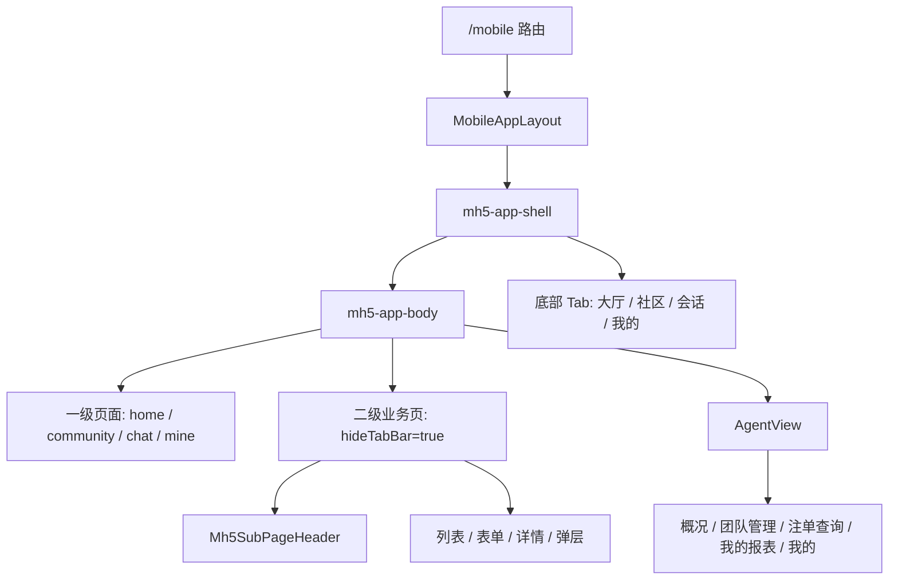

# KK Vibe · H5 移动端统一规范（App 壳层 + PRD 标注）

> 基准结构：`/mobile` → `MobileAppLayout`  
> 主样式：`src/styles/mobile-app-shell.css`  
> 通用组件：`src/components/mobile/*`  
> PRD 标注：`src/components/mobile/Mh5SpecAnnot.vue` + `src/constants/mobilePrdSpec.ts`

## 1. 适用范围

| 路由 / 模块 | 规范 | 说明 |
|-------------|------|------|
| `/mobile/*` | **本规范** | H5 / App WebView 原型，统一走 `MobileAppLayout` 壳层 |
| `/mobile/agent*` | **本规范 + 代理中心分层** | 隐藏 App 底栏，使用 `AgentView` 内部五 Tab |
| `/pc/*` | [PC后台设计规范](./PC后台设计规范.md) | 线框后台，禁止混用 |
| `/` 首页 | 营销 / 导航页 | 不纳入 H5 App 壳层规范 |

移动端页面以 `mobile-app-shell.css` 为唯一主样式入口。新页面不要再以旧演示页结构或 PC 线框结构为基准。

## 2. 当前页面结构



### 2.1 App 容器

`MobileAppLayout` 负责桌面预览画布、手机壳层、路由切换、一级底部导航和安全区。

```vue
<div class="mh5-viewport-canvas">
  <div class="mh5-app-shell">
    <div class="mh5-app-body" :class="{ 'mh5-app-body--immersive': hideTabBar }">
      <RouterView />
    </div>
    <nav v-if="!hideTabBar" class="mh5-app-tabbar" />
  </div>
</div>
```

核心规则：

- `mh5-viewport-canvas`：桌面预览居中背景，不在业务页重复实现。
- `mh5-app-shell`：固定手机画布，宽度 `--mh5-max-width`，高度 `--mh5-viewport-height`。
- `mh5-app-body`：默认为一级 Tab 预留底部导航空间。
- `mh5-app-body--immersive`：用于二级页或代理中心，取消 App 底栏预留。
- `mh5-route-view`：路由页根节点统一 `flex: 1; min-height: 0`，避免内部滚动失效。

### 2.2 一级 Tab 页面

一级 Tab 由 `MobileAppLayout` 统一维护：

| Tab | 路由名 | 页面 | 结构重点 |
|-----|--------|------|----------|
| 大厅 | `mobile-home` | `MobileLobbyPage` | 顶部 Logo / 钱包、公告、分类、游戏卡片、悬浮入口 |
| 社区 | `mobile-community` | `MobileCommunityPage` | 顶部分类 Tab、Banner、社群列表、加入状态 |
| 会话 | `mobile-chat` | `MobileChatPage` | 顶部 Logo / 操作、筛选 Tab、会话列表、未读数 |
| 我的 | `mobile-mine` | `MobileMineView` | 用户信息、钱包、快捷入口、菜单、底部弹层 |

一级页面不自己实现底部导航；如需隐藏底栏，必须通过路由 `meta.hideTabBar`。

### 2.3 二级业务页

二级业务页通常用于设置、账单、详情、授信、上分、邀请、报表等流程。

推荐结构：

```vue
<script setup lang="ts">
import Mh5SubPageHeader from '../../components/mobile/Mh5SubPageHeader.vue'
import '../../styles/mobile-app-shell.css'
</script>

<template>
  <div class="mh5-route-view">
    <Mh5SubPageHeader title="页面标题" />
    <main class="mh5-sub-content">...</main>
  </div>
</template>
```

核心规则：

- 路由配置 `meta: { hideTabBar: true }`，让 `MobileAppLayout` 隐藏一级底栏。
- 顶栏优先使用 `Mh5SubPageHeader`，右侧操作通过 `#right` slot 注入。
- 页面主体用 `mh5-sub-content` 或等价 `flex-1 min-h-0 overflow-auto`。
- 底部固定操作区要预留 `env(safe-area-inset-bottom)`，避免遮挡内容。

### 2.4 代理中心

`/mobile/agent` 使用 `AgentView` 作为内部容器，不复用 App 一级底栏。

| 内部 Tab | 组件 | 说明 |
|----------|------|------|
| 概况 | `AgentOverviewPage` | 资产、收益、快捷数据 |
| 团队管理 | `AgentTeamPage` | 团队列表、创建账号、快捷操作 |
| 注单查询 | `MobileBetOrderQueryView` | 搜索、时间切换、高级筛选、详情弹层 |
| 我的报表 | `AgentReportPage` | 日期筛选、报表卡片 |
| 我的 | `AgentMePage` | 代理个人中心与入口 |

代理中心使用 `AgentBottomNav` 作为内部底栏；切换 Tab 时通过 query `tab` 同步路由状态。

## 3. 设计 Token 与布局约定

### 3.1 主 Token

| Token | 默认值 | 用途 |
|-------|--------|------|
| `--mh5-app-orange` | `#ff7a2b` | 主色、激活态、重点按钮 |
| `--mh5-app-bg` | `#f5f6f8` | App 背景 |
| `--mh5-app-card` | `#fff` | 卡片、列表、弹层 |
| `--mh5-app-text` | `#1a1a1a` | 主要文本 |
| `--mh5-app-text-secondary` | `#8a8f98` | 次要说明、辅助信息 |
| `--mh5-app-border` | `#eef0f3` | 分割线、边框 |
| `--mh5-app-tabbar-h` | `56px` | App 一级底栏高度 |
| `--mh5-app-radius` | `14px` | 常规卡片圆角 |
| `--mh5-max-width` | `375px` | 手机画布宽度 |
| `--mh5-viewport-height` | `812px` | 手机画布高度 |

### 3.2 字号与触控

| 场景 | 建议 |
|------|------|
| 页面主标题 | 18-20px，600-700 |
| 卡片标题 / 列表主信息 | 14-16px，600 |
| 正文 / 按钮 | 13-14px，500 |
| 次要说明 | 11-12px，400，使用次级色 |
| 触控热区 | 按钮和可点列表项建议不低于 44px |

### 3.3 页面滚动

- 外层 `mh5-app-shell` 不滚动，滚动交给业务内容区。
- 路由页根节点必须 `min-height: 0`。
- 列表页使用单一主滚动容器，不要让页面和列表同时滚动。
- 弹层、筛选面板、详情抽屉内部滚动时，底部按钮固定可见。

## 4. 常见页面模块

### 4.1 大厅

适用：`MobileLobbyPage`。

- 顶部展示 Logo、钱包、账单入口。
- 公告条使用单行滚动或截断，避免撑高首屏。
- 分类 / 模式切换使用横向 Tab，选中态用橙色。
- 游戏卡片两列网格，必须提供空状态。
- 悬浮入口不遮挡底部导航和主要按钮。

### 4.2 社区

适用：`MobileCommunityPage`。

- 顶部分类 Tab 固定在页面顶部区域。
- 列表项由图标、标题、描述、加入按钮和人数构成。
- 加入 / 已加入状态文案明确，按钮态可区分。
- 没有数据时展示空状态，不留白。

### 4.3 会话

适用：`MobileChatPage`。

- 顶部包含品牌识别和右侧操作入口。
- 筛选 Tab 与搜索入口同层展示。
- 会话列表展示头像、标题、摘要、时间、未读数。
- 未读数超过上限时使用 `99+`。
- 列表为空展示「暂无会话消息」等明确文案。

### 4.4 我的、钱包与账单

适用：`MobileMineView`、`MobileBillingListView`、`MobileBillingSearchView`、`MobileBillingDetailView`。

- 个人信息、余额、快捷入口和菜单分区展示。
- 钱包或币种切换用底部弹层，筛选项状态清晰。
- 账单列表按日期分组，详情页保留关键字段和状态说明。
- 金额、币种、时间、状态文案必须与 Mock 数据一致。

### 4.5 代理业务

适用：`AgentView` 及代理相关二级页。

- 代理中心内部五 Tab 使用 `AgentBottomNav`，不要和 App 一级底栏同时出现。
- 团队管理列表、快捷操作、创建账号弹层必须处理权限和不可操作状态。
- 授信、上分、收益比例、报表等流程必须有明确的确认、取消、错误和成功反馈。
- 涉及多步骤流程时，步骤条、当前状态、返回逻辑要与 PRD 保持一致。

### 4.6 表单、筛选与弹层

- 搜索框、筛选项、日期区间、状态枚举必须有默认值和重置逻辑。
- 高级筛选弹层应固定底部「重置」「确定」按钮。
- 表单提交前做前端校验，错误文案直接展示在当前上下文。
- 弹层关闭需明确是否保留草稿；取消、遮罩、返回行为保持一致。

## 5. Vue 实现约定

1. 路由挂在 `/mobile` children 下，`meta.title` 供页面标题。
2. 一级 Tab 页面不设置 `hideTabBar`；二级业务页设置 `meta.hideTabBar: true`。
3. 页面统一引入 `src/styles/mobile-app-shell.css`，不要新增独立主样式体系。
4. 状态管理优先 `ref` / `computed`，原型阶段不引入复杂 store。
5. Mock 数据放在 `src/constants/*`，页面只负责状态组合和事件响应。
6. 页面文案、Mock、PRD 标注必须同步维护。
7. 禁止在 `/mobile` 页面使用 PC 的 `pc-wireframe-page`、`wf-*` class。
8. 禁止在业务页重复实现 `mh5-viewport-canvas`、`mh5-app-shell` 或一级底栏。

## 6. 移动端 PRD 标注规范

适用于 H5 / 代理端移动原型的「注N」标注。移动端标注与 PC 后台 `WfSpecAnnot` 分离，不得混用组件或数据结构。

### 6.1 与 PC 标注的差异

| 维度 | PC（WfSpecAnnot） | 移动端（Mh5SpecAnnot） |
|------|---------------------|-------------------------|
| 组件 | `src/components/wireframe/WfSpecAnnot.vue` | `src/components/mobile/Mh5SpecAnnot.vue` |
| 数据类型 | `{ title, items: string[] }` 简版条目 | `MobilePrdSpec`，含六大结构 |
| 触发 | 悬停 / 聚焦 | 点击切换，遮罩关闭 |
| 浮层标签 | 「需求说明 #N」 | 「移动端 PRD · #N」 |
| 编号 | 每页 `{MODULE}_SPEC_ANNOT_NO` 从 1 起 | 同左，写在 `{module}Spec.ts` |

### 6.2 PRD 六大结构

每条移动端标注的 `sections` 必须按顺序包含以下 6 节，每节至少 1 条 `lines`。`Mh5SpecAnnot` 浮层展示时自动加序号：大类为「一、二、三…」，细项为「1. 2. 3.」；`*Spec.ts` 的 `lines` 只写正文，不要手写前缀。

- **一、功能逻辑** `logic`：模块做什么、业务目标、主链路。
- **二、交互行为** `interaction`：用户动作 -> 系统反馈 / 状态变化。
- **三、视觉表现** `visual`：布局、颜色、组件状态、动效；仅写业务 UI，禁止写「注N」标注入口或 PRD 浮层本身。
- **四、数据规则** `data`：格式、枚举、限制、默认值；使用界面中文名，禁止代码字段名和英文枚举。
- **五、异常与边界** `exception`：错误文案、空状态、超时、权限、禁用态。
- **六、关联与跳转** `routing`：入口、出口、路由名、页面勾连。

类型与工具见 `src/constants/mobilePrdSpec.ts`：

- `MobilePrdSpec` / `MobilePrdSpecSection`
- `MOBILE_PRD_SECTION_META`：各节中文名与撰写提示
- `MOBILE_PRD_SECTION_ORDINALS`：一至六，供浮层大类序号使用
- `buildMobilePrdSections()`：按固定顺序组装；视觉表现节自动追加 `MOBILE_PRD_VISUAL_DESIGN_DRAFT_NOTE`
- `MOBILE_PRD_VISUAL_DESIGN_DRAFT_NOTE`：「颜色、字号以实际设计稿为准。」

### 6.3 落地模板

```typescript
import { buildMobilePrdSections, type MobilePrdSpec } from './mobilePrdSpec'

export const XXX_SPEC_ANNOT_NO = {
  mainFeature: 1,
} as const

export const XXX_MAIN_FEATURE_SPEC: MobilePrdSpec = {
  no: XXX_SPEC_ANNOT_NO.mainFeature,
  title: '功能名称',
  sections: buildMobilePrdSections({
    logic: ['...'],
    interaction: ['...'],
    visual: ['...'],
    data: ['...'],
    exception: ['...'],
    routing: ['...'],
  }),
}
```

```vue
<Mh5SubPageHeader title="页面标题">
  <template #right>
    <Mh5SpecAnnot :spec="XXX_MAIN_FEATURE_SPEC" placement="bottom" />
  </template>
</Mh5SubPageHeader>
```

### 6.4 编号与同步规则

- 每个页面内「注N」从 1 起递增；同一页面编号不可重复，不同页面可重新从 1 开始。
- 编号写在 `{MODULE}_SPEC_ANNOT_NO` 常量表中，页面引用常量，不在模板里手写裸数字。
- 一个「注N」只描述一个明确功能或流程。
- 页面或功能有标注时，修改原型必须同步更新对应 `MobilePrdSpec`。
- 修改 PRD 标注时，必须同步检查并调整页面原型、Mock 数据、交互反馈、空状态、禁用态、路由和标注位置。
- 若原型和 PRD 不一致，以最新用户需求为准，同时补齐另一侧；无法判断最新口径时先确认。

### 6.5 撰写要求

- **视觉表现** 只写业务 UI，禁止描述「注N」「需求说明」「PRD 浮层」「标注触发」等标注组件自身。
- **数据规则** 使用页面中文名称，例如「昵称」「金刚号」「待确认」「发送时间」；禁止 `nickname`、`status`、`pending` 等实现名。
- **交互行为** 写清用户动作、系统反馈、按钮文案和状态变化。
- **异常与边界** 覆盖空状态、加载失败、输入非法、权限限制、重复操作和接口失败。
- **关联与跳转** 写清入口来源、目标页面、路由名或用户可见路径。

## 7. 新建 / 修改页面检查清单

- [ ] 页面属于一级 Tab、二级业务页，还是代理中心内部 Tab。
- [ ] 已使用 `MobileAppLayout` 提供的手机壳层，没有重复实现 App 外壳。
- [ ] 已引入 `mobile-app-shell.css`，没有新建独立主样式体系。
- [ ] 二级页已配置 `meta.hideTabBar: true`，并使用 `Mh5SubPageHeader` 或等价标题栏。
- [ ] 一级 Tab 页面没有自己实现底部导航。
- [ ] 固定底部按钮、弹层和筛选面板已处理安全区和内容遮挡。
- [ ] 页面有中文 Mock 数据，且覆盖空态、禁用态、异常态。
- [ ] 页面文案、Mock、路由、PRD 标注保持一致。
- [ ] 如页面有「注N」标注，已同步维护 `MobilePrdSpec`。
- [ ] 未混用 PC 的 `wf-*`、`WfSpecAnnot` 或 `items[]` 简版结构。

## 8. 参考路由

| 路径 | 文件 | 说明 |
|------|------|------|
| `/mobile/home` | `MobileLobbyView.vue` | 大厅首页，一级 Tab |
| `/mobile/community` | `MobileCommunityView.vue` | 社区，一级 Tab |
| `/mobile/chat` | `MobileChatView.vue` | 会话，一级 Tab |
| `/mobile/mine` | `MobileMineView.vue` | 我的，一级 Tab |
| `/mobile/agent` | `AgentView.vue` | 代理中心，内部五 Tab |
| `/mobile/agent/invite-member` | `MobileAgentInviteMemberView.vue` | 邀请现有会员 |
| `/mobile/agent/invite-records` | `MobileAgentInviteRecordsView.vue` | 我的邀请记录 |
| `/mobile/agent/credit` | `MobileAgentCreditView.vue` | 代理授信 |
| `/mobile/agent/xcoin/credit/member` | `MobileXCoinCreditView.vue` | 给会员上分 |
| `/mobile/agent/settlement` | `MobileAgentSettlementDashboardView.vue` | 代理结算对账 |
| `/mobile/mine/billing` | `MobileBillingListView.vue` | 账单列表 |
| `/mobile/mine/billing/:id` | `MobileBillingDetailView.vue` | 账单详情 |
