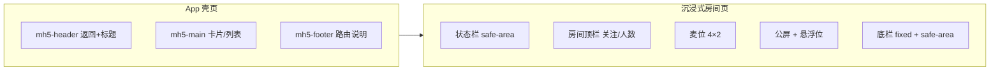

# KK Vibe · H5 移动端设计规范

> 基准页面：`/mobile`（入口）、`/mobile/live-start-notice`（开播通知）、`/mobile/live`（语聊直播）  
> 共享样式：`src/styles/mobile-h5.css`  
> 全局通知组件：`src/components/LiveStartTopNotice.vue` + `useLiveStartNotice`

## 1. 适用范围

| 路由前缀 | 规范 | 说明 |
|----------|------|------|
| `/mobile/*` | **本规范** | H5 / App WebView 原型 |
| `/pc/*` | [PC后台设计规范](./PC后台设计规范.md) | 线框后台，禁止混用 |
| `/` 首页 | 营销/导航页 | 可用全局 `--accent`，非 H5 壳页结构 |

移动端默认 **Tailwind CSS** + 全局 CSS 变量（`src/style.css` 的 `--bg`、`--text-h` 等）；沉浸式直播页使用 **固定深色色板**，不跟随系统浅色壳页。

## 2. 两类页面形态



### 2.1 App 壳页（Hub / 演示控制台）

**参考**：`MobileHubView.vue`、`LiveStartNoticeDemoView.vue`

- 根节点：`class="mh5-page"`（或等价 Tailwind：`min-h-svh flex flex-col bg-[var(--bg)]`）
- 引入：`import '../styles/mobile-h5.css'`
- 最大阅读宽度：内容区可用 `sm:max-w-md sm:mx-auto`（Hub），不强制全屏居中
- **不使用** PC 线框 `wf-*` class

**结构模板**：

```html
<div class="mh5-page">
  <header class="mh5-header">
    <button class="mh5-back">← 返回</button>
    <p class="mh5-eyebrow mh5-eyebrow--rose">模块标签</p>
    <h1 class="mh5-title">页面标题</h1>
    <p class="mh5-desc">副标题说明</p>
  </header>
  <main class="mh5-main">…</main>
  <footer class="mh5-footer">/mobile/xxx</footer>
</div>
```

### 2.2 沉浸式直播 / 语聊房

**参考**：`LiveRoomView.vue`

- 根节点：`mh5-live-room` 或 `max-w-[430px] mx-auto bg-[#1e2a5e]`
- **整页深色** `#1e2a5e`，不受 `--bg` 浅色影响
- 底栏 `fixed` + `mh5-live-footer-fixed`，内容区 `pb` 预留底栏 + `safe-area-inset-bottom`
- 状态栏区：`pt-[max(8px,env(safe-area-inset-top))]`

## 3. 设计 Token

### 3.1 App 壳页（继承 `style.css`）

| 变量 | 用途 |
|------|------|
| `--bg` / `--text` / `--text-h` | 页面背景、正文、标题 |
| `--border` | 分割线、卡片边框 |
| `--social-bg` | 卡片背景 |
| `--accent` | 返回链接、强调色 |
| `--shadow` | 卡片阴影 |

### 3.2 直播沉浸色（`mobile-h5.css`）

| Token | 值 | 用途 |
|-------|-----|------|
| `--mh5-max-width` | `430px` | 房间页最大宽度（iPhone 逻辑宽） |
| `--mh5-live-bg` | `#1e2a5e` | 房间主背景 |
| `--mh5-live-panel` | `#151d40` | 底栏、空麦位底 |
| `--mh5-live-cta` | `#ff7a2b` | 关注按钮、APP 专享标签 |
| `--mh5-live-speaking` | `#5bc6ff` | 发言中光晕 |
| `--mh5-live-chat-user` | `#ffe08a` | 公屏昵称高亮 |

### 3.3 字号（移动端）

| 场景 | 字号 | 字重 |
|------|------|------|
| 页面标题 | 20px (`text-xl`) | 600 |
| 卡片标题 | 14px (`text-sm`) | 600 |
| 正文/按钮 | 14px | 500 |
| 直播公屏 | 12px | 400 |
| 麦位昵称 | 10px | 500 |
| 次要说明 | 11–12px | 400，`opacity` 70% 左右 |

## 4. 组件规范

### 4.1 全局顶部通知（开播 / 上麦）

**挂载**：`App.vue` 内 `<LiveStartTopNotice />`（全局单例）

**触发**：

```ts
import { useLiveStartNotice } from '@/composables/useLiveStartNotice'

const { push, dismiss, dismissAll } = useLiveStartNotice()

push({
  id: 'unique_id',
  kind: 'live_start', // | 'voice_mic_on'
  hostId: '',
  hostName: '小旋风_直播',
  hostAvatar: '旋',
  roomId: 'live_xxx',
  roomTitle: '房间标题',
  micIndex: 3, // 仅 voice_mic_on
}, { durationMs: 6000 })
```

| kind | 文案 | CTA | 强调色 |
|------|------|-----|--------|
| `live_start` | 你关注的主播开播了 | 进入直播间 | 玫瑰/橙渐变 |
| `voice_mic_on` | 你关注的大神在语聊房上麦了 | 进入语聊房 | 天蓝渐变 |

- 位置：顶部居中，`safe-area-inset-top`，`z-index: 9999`
- 队列：多条依次展示，关闭当前后自动顶下一条
- 动画：自上方滑入 `translateY(-100%)` → 0，约 0.32s
- 演示页：`/mobile/live-start-notice`

### 4.2 Hub 入口卡片

**参考**：`MobileHubView.vue`

- `RouterLink` + `mh5-hub-link`（或 Tailwind 等价）
- 左侧 emoji 图标 + 标题 + 路由路径 + 一行描述
- `active:scale-[0.99]`，hover 边框 tint（`hover:border-rose-500/40` 等按模块区分色）

### 4.3 演示控制台卡片

**参考**：开播通知演示区

- 容器：`mh5-card`
- 主操作：`mh5-btn mh5-btn--primary`（深色实心）
- 次要：`mh5-btn--sky` / `mh5-btn--outline` / `mh5-btn--ghost-danger`
- 状态条：`rounded-lg bg-black/5 px-3 py-2 text-xs`（暗色模式 `dark:bg-white/5`）

### 4.4 直播麦位（4×2）

| 状态 | 表现 |
|------|------|
| 有人 + 发言中 | 蓝色外发光 `mh5-speaking-ring` + 「发言中」胶囊 |
| 有人 + 闭麦 | 红色麦克风斜杠角标 |
| 主播 | 粉色圆标 + 声波 icon |
| 房管 | 蓝色「管」字角标 |
| 空麦 1–6 | 虚线框 + 「加入 N 麦」 |
| 空麦 7–8 | 「APP专享」橙标 + 点击唤起 App / 下载 |

### 4.5 公屏消息类型

| type | 样式要点 |
|------|----------|
| `enter` | 渐变胶囊 + 等级 + 金色昵称 |
| `system` | 半透明白底圆角条 |
| `chat` | `昵称:` + 正文 |
| `gift` | 昵称 + 送 + 礼物名 + ×数量 |

右侧预留 **72px** 给悬浮游戏位，公屏 `pr-[76px]`。

### 4.6 底栏（直播）

- 输入条：圆角胶囊 `bg-[#0f142e]/90` + placeholder「说点什么...」
- 图标：下麦、游戏、礼物、更多
- 高度含安全区：`mh5-live-footer-fixed`

## 5. 交互与无障碍

1. **触控热区**：按钮最小高度 **44px**（`--mh5-touch-min`）
2. **按压反馈**：`active:scale-[0.98]` 或 `mh5-btn:active`
3. **安全区**：顶部通知、直播状态栏、底栏必须处理 `env(safe-area-inset-*)`
4. **无障碍**：通知浮层 `role="alert"` `aria-live="polite"`；图标按钮加 `aria-label`
5. **滚动**：公屏 `overflow-y-auto` + 细滚动条（`scrollbar-thin`）

## 6. Vue 实现约定

1. 路由：`/mobile/...`，`meta.title` 供浏览器标题
2. 状态：`ref` / `computed`，全局通知用 composable 单例
3. 中文 Mock：昵称、房间名、公屏文案需符合直播场景
4. 返回：壳页 `router.push({ name: 'mobile' })`；直播页顶栏 ×
5. **禁止** 在 `/mobile` 使用 PC `pc-wireframe-page` / `wf-*`

## 7. 新建 H5 页检查清单

- [ ] 已判断属于「壳页」还是「沉浸房间」，选用对应布局
- [ ] 壳页已引入 `mobile-h5.css`（或使用文档中的 Tailwind 等价组合）
- [ ] 含返回入口与中文 Mock 数据
- [ ] 按钮具备按压态与安全区
- [ ] 若需顶部推送，走 `useLiveStartNotice`，不重复造浮层
- [ ] 直播相关页宽度 ≤ 430px，深色背景一致

## 8. 参考路由

| 路径 | 文件 | 说明 |
|------|------|------|
| `/mobile` | `MobileHubView.vue` | 二级入口 Hub |
| `/mobile/live-start-notice` | `LiveStartNoticeDemoView.vue` | 通知演示（壳页标准样例） |
| `/mobile/live` | `LiveRoomView.vue` | 语聊直播沉浸页 |
| `/mobile/agent` | `AgentView.vue` | 代理深色业务页（变体） |
| `/mobile/mic` | `MicControlStatesView.vue` | 麦控状态 |
| `/mobile/app-join-mic` | `VoiceRoomAppJoinMicView.vue` | App 唤起上麦 |

## 9. API 字段建议（应用内通知）

```json
{
  "id": "string",
  "kind": "live_start | voice_mic_on",
  "host_id": "string",
  "host_name": "string",
  "host_avatar": "string",
  "room_id": "string",
  "room_title": "string",
  "mic_index": 3
}
```
