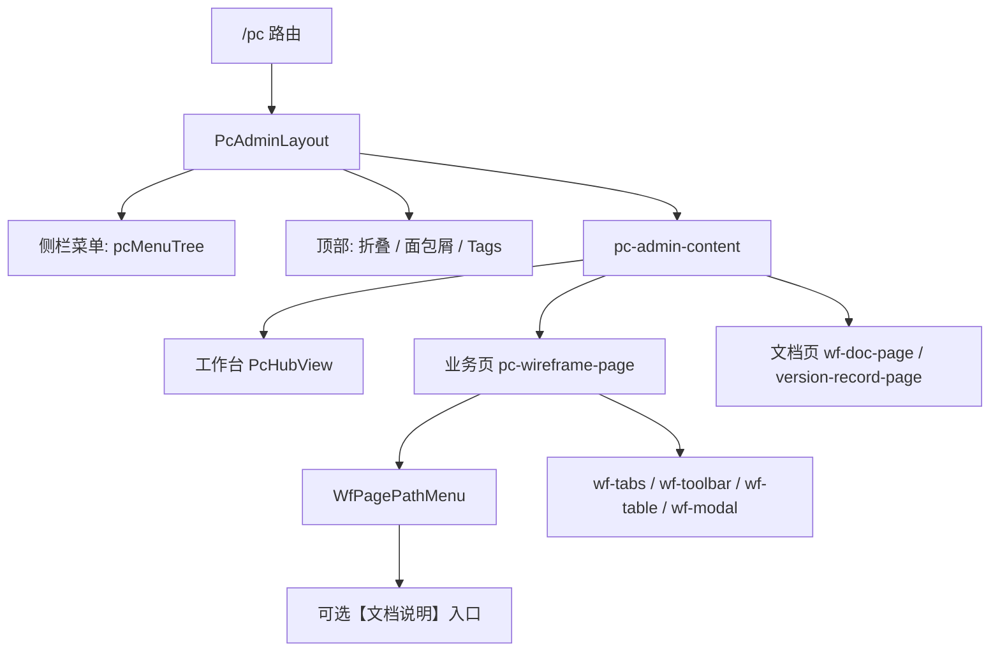

# KK Vibe · PC 后台统一规范（壳层 + 线框 + PRD）

> 后台壳层：`src/layouts/PcAdminLayout.vue` + `src/styles/pc-admin-layout.css`  
> 业务线框：`src/styles/pc-wireframe.css`  
> 菜单 / 路径 / 文档入口：`src/config/pcMenu.ts`  
> PRD 类型：`src/constants/pcPrdSpec.ts`

## 1. 适用范围

| 场景 | 规范 |
|------|------|
| `/pc/*` 后台页面 | 必须使用 `PcAdminLayout` 提供的侧栏、面包屑、Tags 和内容区 |
| 业务原型页 | 使用 `pc-wireframe-page` + `wf-*` 线框组件 |
| 文档 / PRD 页 | 使用 `wf-doc-page` 或版本记录页结构 |
| 移动端 `/mobile/*` | 不使用本规范，遵循 H5 移动端规范 |
| 旧 PC 页面 | 可逐步迁移，新功能禁止继续扩散旧 Tailwind 卡片风 |

PC 后台分为两层：外层是固定后台壳层，内层是业务线框页面。业务页只负责 `pc-wireframe-page` 内部内容，不重复实现侧栏、顶部面包屑或 Tags。

## 2. 当前后台结构



### 2.1 后台壳层

`PcAdminLayout` 统一负责：

- 左侧侧栏：`pcMenuTree` 分组菜单、折叠态、当前路由高亮。
- 顶部面包屑：来自 `getPcBreadcrumb()`，展示系统级位置。
- Tags：已打开页面标签，支持关闭和切换。
- 内容区：`pc-admin-content` 内渲染当前业务页。

业务页禁止硬编码后台侧栏、顶部系统面包屑或 Tags。

### 2.2 菜单单一数据源

`src/config/pcMenu.ts` 是 PC 菜单、路径条和文档入口的单一数据源。

| 字段 | 用途 |
|------|------|
| `key` | 菜单唯一标识，建议 kebab-case |
| `title` | 侧栏、Tags、页面标题口径 |
| `path` | 路由路径 |
| `routeName` | 路由名称，需与 `router/index.ts` 一致 |
| `icon` | 侧栏图标 |
| `pagePath` | 页面内黄色路径条「路径：A-B-C」 |
| `docRouteName` | 关联文档说明页，路径条展示【文档说明】 |
| `children` | 侧栏分组子菜单 |

新增页面时，优先更新 `pcMenu.ts` 和 `/pc` children 路由；不要在业务页里硬编码路径层级。

### 2.3 页面路径条

业务页如有 `pagePath`，页面顶部使用：

```vue
<script setup lang="ts">
import WfPagePathMenu from '../../components/wireframe/WfPagePathMenu.vue'
</script>

<template>
  <div class="pc-wireframe-page">
    <WfPagePathMenu />
    ...
  </div>
</template>
```

`WfPagePathMenu` 会读取当前路由的 `pagePath`，并在配置 `docRouteName` 时展示【文档说明】入口。

## 3. 视觉风格与 Token

### 3.1 后台壳层

| Token | 用途 |
|-------|------|
| `--pc-layout-bg` | 后台内容区底色 |
| `--pc-layout-sidebar-bg` | 左侧菜单底色 |
| `--pc-layout-sidebar-width` | 侧栏宽度 |
| `--pc-layout-header-height` | 顶部面包屑 + Tags 高度 |
| `--pc-tag-active-bg` | Tags / 侧栏激活色 |

### 3.2 业务线框

| Token | 值 | 用途 |
|-------|-----|------|
| `--pc-bg-page` | `#fff` | 业务页底色 |
| `--pc-text` | `#333` | 正文、表头 |
| `--pc-text-secondary` | `#666` | 辅助说明 |
| `--pc-text-muted` | `#999` | 空态、不可操作 |
| `--pc-primary` | `#1890ff` | 主按钮、链接 |
| `--pc-danger` | `#ff4d4f` | 清除、删除、危险操作 |
| `--pc-border` | `#d9d9d9` | 输入框、Tab 外框 |
| `--pc-border-light` | `#e8e8e8` | 表格单元格 |
| `--pc-notice-bg` | `#fffbe6` | 路径条、提示条 |

字号与控件：

- 正文 14px，辅助 12px，弹框标题 16px。
- 输入框、下拉、按钮统一 32px 高。
- 线框页保持白底、1px 描边、2px 圆角，贴近 Ant Design 原型稿。

## 4. 页面类型

### 4.1 工作台入口

适用：`PcHubView`。

- 使用 `pc-dashboard`、`pc-dashboard__grid`、`pc-dashboard__card`。
- 卡片标题、描述、入口路径与 `pcMenu.ts` 保持一致。
- 工作台只做快捷入口，不承载业务筛选和表格。

### 4.2 普通业务列表页

适用：账变管理、禁言列表、贴图管理、超级群管理等。

推荐结构：

```vue
<script setup lang="ts">
import WfPagePathMenu from '../../components/wireframe/WfPagePathMenu.vue'
import '../../styles/pc-wireframe.css'
</script>

<template>
  <div class="pc-wireframe-page">
    <WfPagePathMenu />
    <section class="wf-block">
      <div class="wf-toolbar">...</div>
      <div class="wf-table-wrap">
        <table class="wf-table">...</table>
      </div>
      <div class="wf-pagination">分页组件</div>
    </section>
  </div>
</template>
```

要求：

- 筛选区使用 `wf-toolbar`，字段标签用 `wf-label`。
- 主操作使用 `wf-btn--primary`，清除使用 `wf-btn--danger`，新增使用 `wf-btn--add`。
- 表格必须有空态：`wf-td--empty`。
- 操作列使用文字链或语义按钮；删除类使用 `wf-link-del`。
- Mock 数据使用中文运营语境，覆盖空态、禁用态、异常态。

### 4.3 v2 账变类页面

适用：`pcMenuV2Children` 下的用户详情、账变管理、账变记录、账变审核、提现流水、对账相关。

要求：

- 菜单只改 `src/config/pcMenu.ts` 的 `pcMenuV2Children`。
- 页面路径条来自 `pagePath`，不要在页面内写死路径数组。
- 路由注册在 `/pc` children 下，`meta.title` 与菜单 `title` 保持一致。
- 功能清单和页面标注优先维护在 `src/constants/versionRecordV2.ts`。
- 页面内「注N」编号与 `VERSION_V2_SPEC_ANNOT_NO` 对齐。

### 4.4 配置 / 运营管理页

适用：贴图包、贴图标签、直播中控、超级群、语聊相关配置页。

- 列表 + 筛选 + 表格为主，复杂配置用弹框或抽屉式块。
- 批量上传、导出、启用 / 禁用等操作需展示成功、失败和不可操作状态。
- 若存在多 Tab 配置，使用 `wf-tabs`，仅一个 `wf-tab--active`。
- 业务说明用 `wf-notice` 或 `wf-page-path`，不要在页面顶部新增自定义大块 Hero。

### 4.5 复杂表单 / 弹框页

适用：占成代理配置、授信、多品类比例、账变发起 / 审核等。

弹框规则：

- 使用 `<Teleport to="body">` + `wf-modal-mask`。
- 结构固定为 `wf-modal__header` → `wf-modal__body` → `wf-modal__footer`。
- 底部按钮右对齐，取消用 `wf-btn--default`，确认用 `wf-btn--primary`。
- 内容较高时根节点加 `wf-modal--scroll`，整体高度不超过视口 70%，仅 `wf-modal__body` 内部滚动。
- 校验错误就近展示，提交失败保留用户已填内容。

弹框两种模式：

| 类型 | 示例 | 前置步骤 |
|------|------|----------|
| 需查询确认 | 新增特定用户 / 发起账变 | 输入 ID → 查询 → 展示确认信息 → 填配置 → 确定 |
| 直接选择 | 新增配置项 / 批量配置 | 选择对象 → 填写配置 → 确定 |

### 4.6 文档型页面

适用：版本记录页、产品调研页、PRD 文档说明页。

- 根节点仍使用 `pc-wireframe-page`，需要 PRD 卡片时叠加 `wf-doc-page`。
- 文档页可使用 `wf-tabs` 切换「概要 / 功能清单 / 修订记录」。
- 表格仍使用 `wf-table`，说明段落可使用页面级 scoped class。
- 文档说明入口不放在功能清单里，路径条【文档说明】只是导航入口。

## 5. 线框组件规范

### 5.1 Tab 与提示条

```html
<div class="wf-top">
  <div class="wf-tabs">
    <button type="button" class="wf-tab wf-tab--active">模块 A</button>
    <button type="button" class="wf-tab">模块 B</button>
  </div>
  <div class="wf-notice">
    <span class="wf-notice-label">说明标题：</span>
    正文说明…
  </div>
</div>
```

- 仅一个 Tab 为 `wf-tab--active`。
- Tab 带需求标注时，「注」不得嵌套在 `wf-tab` 内；使用 `wf-tab-item` 包裹 Tab 按钮，标注放按钮外侧。

```html
<div class="wf-tab-item">
  <button type="button" class="wf-tab">信用</button>
  <WfShareAgentCreditTabAnnot />
</div>
```

### 5.2 工具栏与按钮

| class | 场景 |
|-------|------|
| `wf-btn--primary` | 搜索、查询、确定 |
| `wf-btn--danger` | 清除、危险描边操作 |
| `wf-btn--add` | 新增类入口 |
| `wf-btn--default` | 弹框取消 |

工具栏可换行，但不要把筛选项拆成多个视觉割裂的卡片。

### 5.3 表格

- 表头：`wf-th`，背景 `#fafafa`。
- 编号列：`wf-th--no` / `wf-td--center`。
- 操作列：`wf-th--op` / `wf-td--actions`。
- 单元格正文默认换行（`word-break: break-word`），禁止省略号截断；编号列、状态列、操作列可单独 `white-space: nowrap`。
- 不可操作：`<span class="wf-muted">不可删除</span>`。
- 无数据：`wf-td--empty`。
- 比例输入：`wf-input wf-input--pct` + `wf-pct` 后缀。
- 分页：原型阶段用 `<div class="wf-pagination">分页组件</div>` 占位。

## 6. PRD 标注与文档说明页

业务页存在 `WfSpecAnnot`（「注」）标注时，应同步提供 PRD / 功能清单数据。对外可通过文档说明子页聚合展示。

### 6.1 页面「注N」

- 每个业务页的 `WfSpecAnnot` 必须传 `:no`。
- 编号与当页功能清单 `id` 对齐，各页独立从 1 起编。
- 编号写在 `{MODULE}_SPEC_ANNOT_NO` 常量表中。
- 功能清单可有无页面标注的条目，该 `id` 不占标注位。
- 修改原型时同步更新 PRD；修改 PRD 时同步检查并调整原型。

示例：

```ts
export const SHARE_AGENT_SPEC_ANNOT_NO = {
  filterAgentLevel: 1,
  filterCreditAgent: 2,
  creditBadge: 3,
  grantAction: 5,
  creditTab: 7,
  share: 8,
  rebate: 9,
} as const
```

### 6.2 PRD 六大维度

功能清单每条须覆盖：

1. 功能逻辑
2. 交互行为
3. 视觉表现
4. 数据规则
5. 异常与边界
6. 关联与跳转

类型见 `src/constants/pcPrdSpec.ts`。

### 6.3 文档说明页

配置方式：

- 业务页菜单项配置 `docRouteName`。
- 文档页信息配置在 `pcDocRoutes`。
- 业务页顶部使用 `<WfPagePathMenu />`，自动展示【文档说明】入口。
- 文档页根节点：`pc-wireframe-page wf-doc-page`。
- 功能清单描述业务功能本身，不包含「文档说明入口」。

参考：`PcShareAgentConfigDocView.vue`、`shareAgentConfigSpec.ts`。

## 7. Vue 实现约定

1. 页面挂在 `/pc` children 下，`meta.title` 供文档标题和 Tags 使用。
2. 菜单、路径条、文档入口统一维护在 `pcMenu.ts`。
3. PC 业务页引入 `pc-wireframe.css`；工作台引入 `pc-admin-layout.css`。
4. 状态管理优先 `ref` / `computed`，原型阶段不引入复杂 store。
5. Mock 数据放在 `src/constants/*`，页面只做状态组合与事件响应。
6. 页面文案、Mock、PRD 标注必须同步维护。
7. 禁止在 PC 新页使用移动端 Tailwind 卡片主布局。
8. 禁止业务页硬编码旧式「一、直播管理/…」路径文本；使用 `pagePath` + `WfPagePathMenu`。

## 8. 新建 / 修改 PC 页面检查清单

- [ ] 路由已注册在 `/pc` children，`name` 以 `pc-` 开头，`meta.title` 与菜单一致。
- [ ] 菜单已配置在 `pcMenu.ts`，分组、图标、`pagePath`、`docRouteName` 口径正确。
- [ ] 页面根节点为 `pc-wireframe-page`，并引入 `pc-wireframe.css`。
- [ ] 有 `pagePath` 的页面已使用 `WfPagePathMenu`。
- [ ] 筛选、表格、分页、空态、禁用态、错误态完整。
- [ ] 弹框有取消 / 确定，高弹框已使用 `wf-modal--scroll`。
- [ ] Tab 标注放在 `wf-tab-item` 外侧，不在 `wf-tab` 按钮内部。
- [ ] Mock 数据为中文运营语境，覆盖边界样例。
- [ ] 有「注N」标注时，已维护 `{MODULE}_SPEC_ANNOT_NO`，编号与功能清单 `id` 对齐。
- [ ] 有文档说明页时，已配置 `docRouteName`、`pcDocRoutes` 和文档子路由。
- [ ] 原型、PRD、功能清单、页面标注保持一致。

## 9. 参考页面与路由

| 路径 | 文件 | 说明 |
|------|------|------|
| `/pc` | `PcHubView.vue` | 工作台入口 |
| `/pc/version-record/v2-account-turnover/intro` | `PcVersionRecordV2View.vue` | v2 需求简介 / 修订记录 |
| `/pc/account-change-manage` | `PcAccountChangeManageView.vue` | v2 账变类列表页 |
| `/pc/account-change-record` | `PcAccountChangeRecordView.vue` | 账变记录 |
| `/pc/account-change-audit` | `PcAccountChangeAuditView.vue` | 风控账变审核 |
| `/pc/withdraw-turnover-record` | `PcWithdrawTurnoverRecordView.vue` | 提现流水变更记录 |
| `/pc/reconciliation-related` | `PcReconciliationRelatedView.vue` | 对账相关 |
| `/pc/live-broadcast` | `PcLiveBroadcastManageView.vue` | 直播中控台 |
| `/pc/live-commission` | `LiveCommissionConfigView.vue` | Tab + 表格 + 弹框参考页 |
| `/pc/sticker-pack-manage` | `PcStickerPackManageView.vue` | 配置管理页 |
| `/pc/share-agent-config` | `PcShareAgentConfigView.vue` | 复杂授信 / PRD 标注页 |
| `/pc/share-agent-config/doc` | `PcShareAgentConfigDocView.vue` | PRD 文档说明页 |
