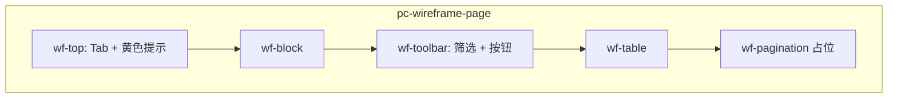

# KK Vibe · PC 后台设计规范

> 基准页面：`/pc/live-commission`（直播佣金配置）  
> 样式文件：`src/styles/pc-wireframe.css`  
> 参考实现：`src/views/LiveCommissionConfigView.vue`

## 1. 适用范围

| 场景 | 规范 |
|------|------|
| 路由以 `/pc` 开头的管理后台 | **必须** 使用本规范 |
| 列表 + 筛选 + 表格 + 弹框表单 | 使用 `wf-*` class |
| 移动端 `/mobile` | 不使用本规范（Tailwind 移动优先） |
| 旧页面（如语聊打赏后台） | 逐步迁移，新功能禁止新增 Tailwind 卡片风 |

## 2. 设计原则

1. **线框后台风**：白底、1px 描边、2px 圆角，贴近 Ant Design 原型稿，非圆角卡片 / 非深色 Hero。
2. **Tab 导航**：多子模块用顶部 Tab 切换，**不使用面包屑**（如「一、直播管理/…」已废弃）。
3. **中文运营文案**：按钮、占位符、表头使用真实后台用语（搜索、清除、确定、不可删除）。
4. **原型数据**：列表须有 Mock 中文数据；空态、错误提示、禁用态需可见。

## 3. 色彩与字体

| Token | 值 | 用途 |
|-------|-----|------|
| `--pc-text` | `#333` | 正文、表头 |
| `--pc-text-secondary` | `#666` | 辅助说明（wf-tip） |
| `--pc-text-muted` | `#999` | 空态、不可删除 |
| `--pc-primary` | `#1890ff` | 主按钮、新增按钮文字 |
| `--pc-danger` | `#ff4d4f` | 清除边框、删除链接 |
| `--pc-tab-active-bg` | `#595959` | Tab 选中背景 |
| `--pc-notice-bg` | `#fffbe6` | 黄色提示条背景 |
| `--pc-border` | `#d9d9d9` | 输入框、Tab 外框 |
| `--pc-border-light` | `#e8e8e8` | 表格单元格 |

- 正文字号：**14px**；辅助 **12px**；弹框标题 **16px** 加粗。
- 控件高度：**32px**（输入框、按钮、下拉统一）。

## 4. 页面结构



### 4.1 页面根节点

```html
<div class="pc-wireframe-page">
  <!-- 内容 -->
</div>
```

```ts
import '../styles/pc-wireframe.css'
```

### 4.2 Tab + 优先级提示

```html
<div class="wf-top">
  <div class="wf-tabs">
    <button type="button" class="wf-tab wf-tab--active">模块 A</button>
    <button type="button" class="wf-tab">模块 B</button>
  </div>
  <div class="wf-notice">
    <span class="wf-notice-label">说明标题：</span>
    正文说明…
  </div>
</div>
```

- 仅一个 Tab 为 `wf-tab--active`（深灰底白字）。
- 提示条与 Tab 同一行，窄屏自动换行。

### 4.3 工具栏

```html
<div class="wf-toolbar">
  <label class="wf-label">主播ID：</label>
  <input class="wf-input" placeholder="请输入用户ID" />
  <button type="button" class="wf-btn wf-btn--primary">搜索</button>
  <button type="button" class="wf-btn wf-btn--danger">清除</button>
  <button type="button" class="wf-btn wf-btn--add">新增xxx</button>
  <p class="wf-tip">注意：……</p>
</div>
```

| 按钮 class | 场景 |
|------------|------|
| `wf-btn--primary` | 搜索、查询、确定 |
| `wf-btn--danger` | 清除（白底红字红框） |
| `wf-btn--add` | 新增类入口（浅蓝底） |
| `wf-btn--default` | 弹框取消 |

### 4.4 表格

- 表头：`wf-th`，背景 `#fafafa`。
- 编号列：`wf-th--no` / 居中 `wf-td--center`。
- 操作列：`wf-th--op`，删除用 `wf-link-del`（文字链，非按钮）。
- 不可操作：`<span class="wf-muted">不可删除</span>`。
- 无数据：`wf-td--empty`。
- 比例输入：`wf-input wf-input--pct` + 后缀 `wf-pct`（%）。
- 底部分页：原型阶段用 `<div class="wf-pagination">分页组件</div>` 占位。

### 4.5 弹框

- 使用 `<Teleport to="body">` + `wf-modal-mask`，点击遮罩关闭（`@click.self`）。
- 结构：`wf-modal__header`（标题 + ×）→ `wf-modal__body` → `wf-modal__footer`（取消右对齐 + 确定）。
- 表单分区：查询区 `wf-modal__hint` 报错；佣金等字段区 `wf-modal__commission`（顶部分割虚线）。
- 未满足前置条件时：`wf-modal__commission--disabled` + `wf-modal__commission-tip`。

#### 弹框两种模式

| 类型 | 示例 | 前置步骤 |
|------|------|----------|
| **需查询确认** | 新增特定用户 | 输入 ID → 查询 → 表格展示 → 配佣金 → 确定 |
| **直接选择** | 新增渠道配置 | 下拉选渠道 → 配佣金 → 确定（无查询表） |

## 5. Vue 实现约定

1. **状态**：`ref` / `computed` 即可，不引入 Pinia（原型阶段）。
2. **路由**：PC 页挂在 `/pc/*`，`meta.title` 供 `document.title`。
3. **入口**：`PcHubView` 卡片链到各子页，子页**不要**再加「返回」顶栏（除非产品明确要求）。
4. **佣金模式**（业务复用）：

```ts
type CommissionMode = 'both' | 'game' | 'gift' | 'none'
// both | gift → 展示礼物比例
// both | game → 展示游戏返佣
// none → 比例列显示 —
```

## 6. 新建 PC 页面检查清单

- [ ] 根节点 `pc-wireframe-page` 且已 `import` `pc-wireframe.css`
- [ ] 未使用面包屑、大圆角卡片、Tailwind `rounded-xl` 主布局
- [ ] Tab / 工具栏 / 表格 / 分页 class 符合上文
- [ ] 主按钮、清除、新增按钮语义正确
- [ ] 弹框有取消/确定，禁用态与错误文案齐全
- [ ] Mock 数据为中文且含边界样例（空列表、不可删行）

## 7. 参考页面

| 路径 | 说明 |
|------|------|
| `/pc/live-commission` | Tab 三模块、双弹框、佣金模式（标准样例） |
| `/pc` | PC 入口聚合 |
| `/pc/reward` | 旧版 Tailwind，待迁移 |

## 8. API 字段命名建议（佣金类）

```json
{
  "commission_mode": "both | game | gift | none",
  "gift_share_percent": 55,
  "game_rebate_percent": 12,
  "channel_id": "string",
  "channel_name": "string",
  "user_id": "string"
}
```
