# 语聊房 · 角色权限与麦控规范

> **版本**：v1.1（原型 PRD）  
> **范围**：仅 **禁音 / 禁麦**（语音麦控），**不含** 弹幕 / 公屏文字禁言  
> **关联原型**：`LiveRoomView.vue`、`MicControlStatesView.vue`

---

## 1. 适用范围

| 在范围内 | 不在范围内 |
|----------|------------|
| 开麦 / 闭麦、单麦禁麦、全体禁麦 | 弹幕禁言、公屏文字管控 |
| 踢麦、下麦、换位子、关闭麦位 | 聊天敏感词、禁言列表 |
| 房管任免（仅房主） | 后台运营非实时策略（另文档） |
| **礼物打赏**（全角色、麦上全员、不可打赏自己） | 对未上麦观众打赏（若产品不做） |

下文凡出现「禁言」字样，均指 **语音禁麦**，非弹幕。

---

## 2. 角色与身份来源

| 角色 | 身份来源 | 说明 |
|------|----------|------|
| **房主** | 创建房间 | 自动占 **1 号麦**，**不可换位** |
| **房管** | 房主任命；运营后台配置 | 管理权弱于房主 |
| **其他麦** | 上麦成功（非 1 号麦用户） | 仅自控 + 观众互动能力 |
| **普通观众** | 进入房间未上麦 | 打赏、关注；可申请上麦 |

**权限层级（高 → 低）**：房主 > 房管 > 其他麦 > 普通观众。

---

## 3. 角色能力清单

### 3.1 房主

| 类别 | 能力 | 作用对象 | 备注 |
|------|------|----------|------|
| 麦控 | 开麦 / 闭麦 | 自己、任意在麦用户 | 含强制闭麦 |
| 麦位 | 踢麦 | 普通在麦用户、**房管** | 1 号麦本人不可被他人踢 |
| 麦位 | 关闭位子 | 2～N 号麦 | 1 号麦建议永不关闭 |
| 麦位 | — | **1 号麦** | **不可换位** |
| 房间 | 全体禁麦 | 全房在麦 + 后续上麦默认闭麦 | 非弹幕 |
| 房间 | 单麦禁麦 | 指定麦位 / 用户 | 含对房管 |
| 管理 | **设置 / 撤销房管** | 观众或麦上用户 | **仅房主** |
| 互动 | 礼物打赏 / 关注 | **麦上所有用户**（不含自己） | 见 [3.5](#35-礼物打赏全角色通用) |

### 3.2 房管

| 类别 | 能力 | 作用对象 | 限制 |
|------|------|----------|------|
| 麦控 | 开麦 / 闭麦 | 自己、普通在麦用户 | 对房主（1 号麦）建议不可强制 |
| 麦位 | 踢麦 | **仅普通在麦用户** | **不可踢房管、不可踢房主** |
| 麦位 | 对房管 | **仅单麦禁麦** | 不可踢、不可任免 |
| 麦位 | 下麦 | 自己 | — |
| 麦位 | 换位子 | 自己 ↔ 空麦等 | **不可占 / 换 1 号麦** |
| 麦位 | 关闭位子 | 2～N 号麦 | 不可关 1 号麦 |
| 房间 | 全体禁麦 | 全房在麦 | 房主可解除 |
| 房间 | 单麦禁麦 | 指定麦（含其它房管） | 非弹幕 |
| 管理 | ~~设置 / 撤销房管~~ | — | **禁止** |
| 互动 | 礼物打赏 / 关注 | **麦上所有用户**（不含自己） | 见 [3.5](#35-礼物打赏全角色通用) |

### 3.3 其他麦

| 能力 | 说明 |
|------|------|
| 开麦 / 闭麦 | 仅自己；被禁麦时不可开麦 |
| 下麦 | 自己 |
| 换位子 | 不可换入 1 号麦 |
| 礼物打赏 / 关注 | **麦上所有用户**（不含自己） |

### 3.4 普通观众

| 能力 | 说明 |
|------|------|
| 礼物打赏 / 关注 | **麦上所有用户**（不含自己） |
| 上麦 | 麦位未关闭、未全体禁麦、满足门槛时申请 |

### 3.5 礼物打赏（全角色通用）

礼物打赏与麦控权限 **无关**：**房主、房管、其他麦、普通观众** 均可发起打赏。

| 规则 | 说明 |
|------|------|
| **可操作角色** | 全角色（房主 / 房管 / 其他麦 / 观众） |
| **可打赏对象** | 当前房间内 **所有在麦用户**（1～N 号麦上有人即可选） |
| **禁止** | **不可打赏自己**（本人 uid = 目标 uid 时入口禁用或接口拒绝） |
| **空麦位** | 无人的麦位不可作为打赏目标 |
| **与关注** | 关注规则若独立配置，打赏对象范围建议与上表一致 |

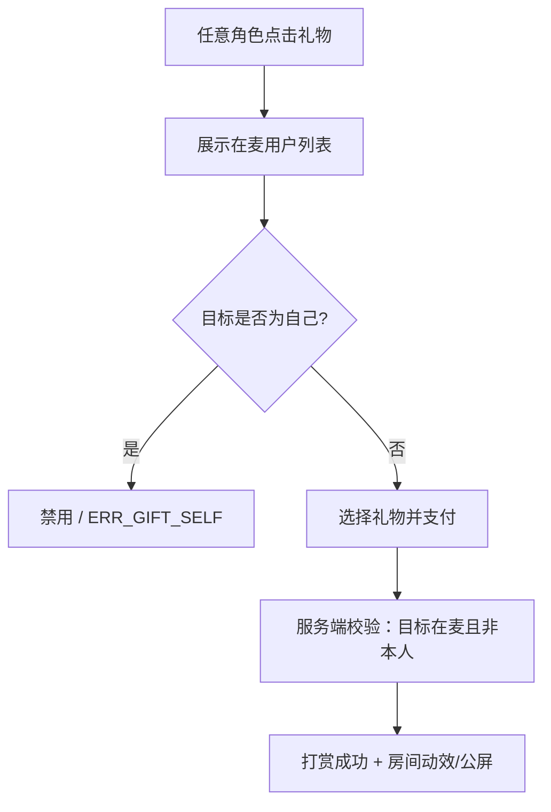

---

## 4. 权限层级与继承

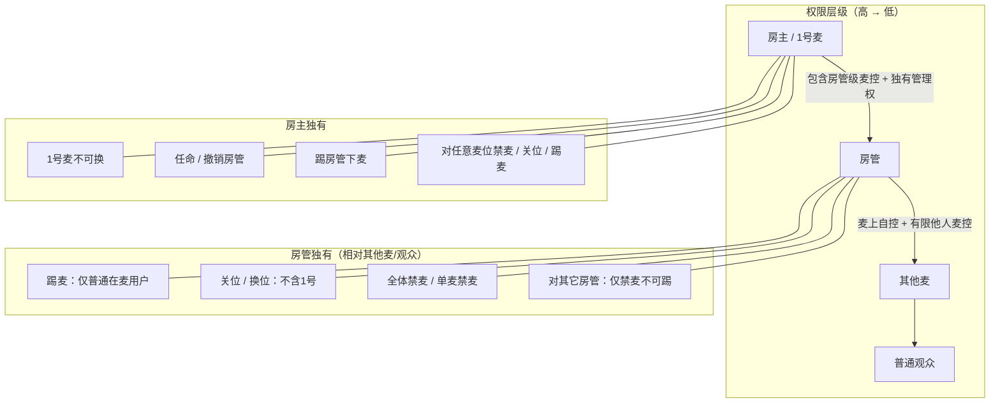

**冲突规则**

1. 同一条指令：**房主 > 房管 > 本人**。
2. **房管不可** 设置 / 撤销房管，**不可** 踢房管下麦；对其它房管 **仅可禁麦**。
3. **房主** 可随时撤销任意房管；踢房管、任免房管仅房主可操作。

---

## 5. 控制范围总览

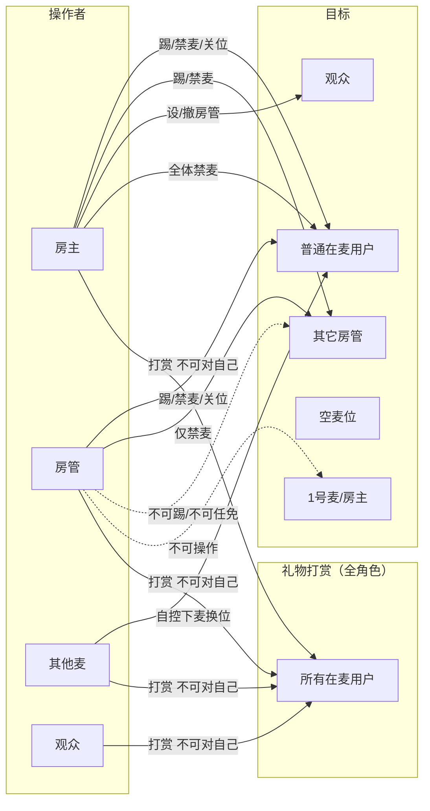

---

## 6. 核心流程

### 6.1 进房与角色判定

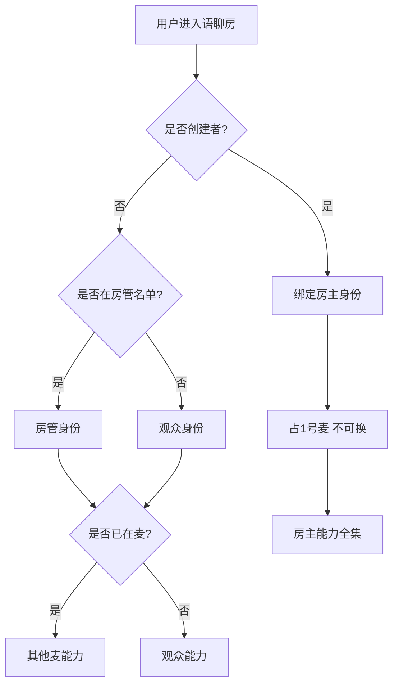

### 6.2 上麦 / 踢麦 / 下麦

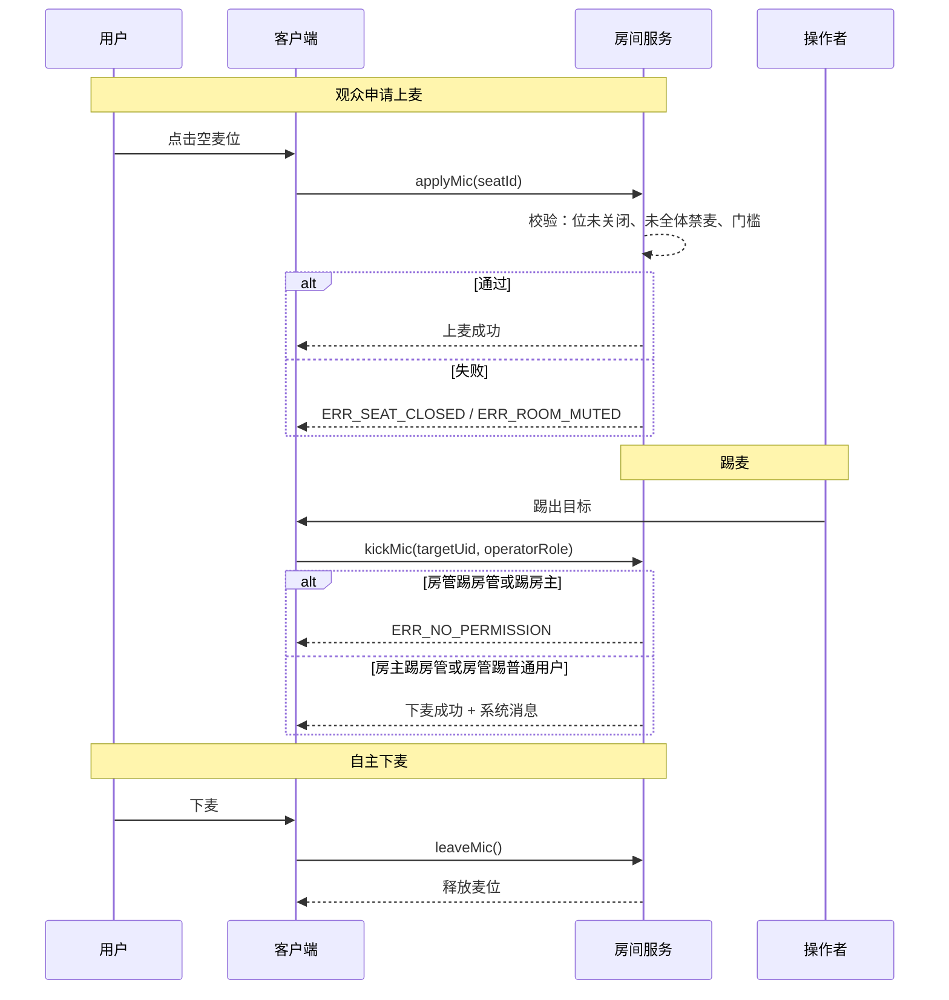

### 6.3 设置 / 撤销房管（仅房主）

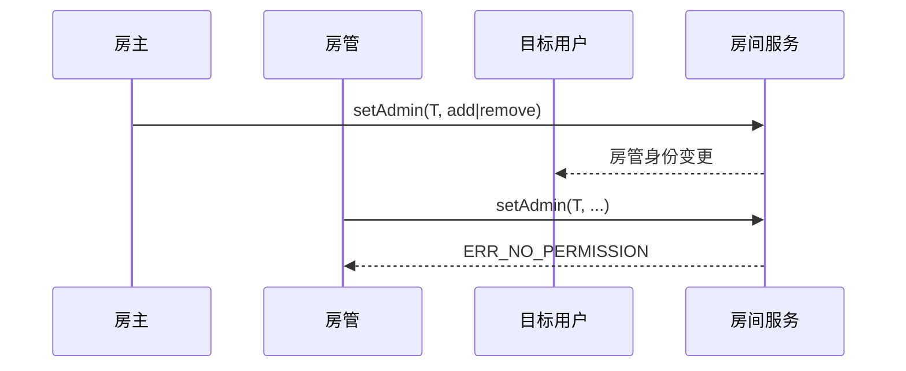

### 6.4 房管对房管：仅禁麦

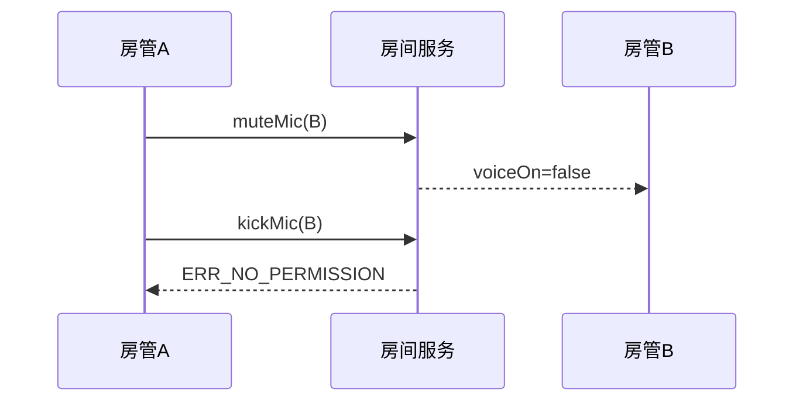

### 6.5 全体禁麦 / 单麦禁麦

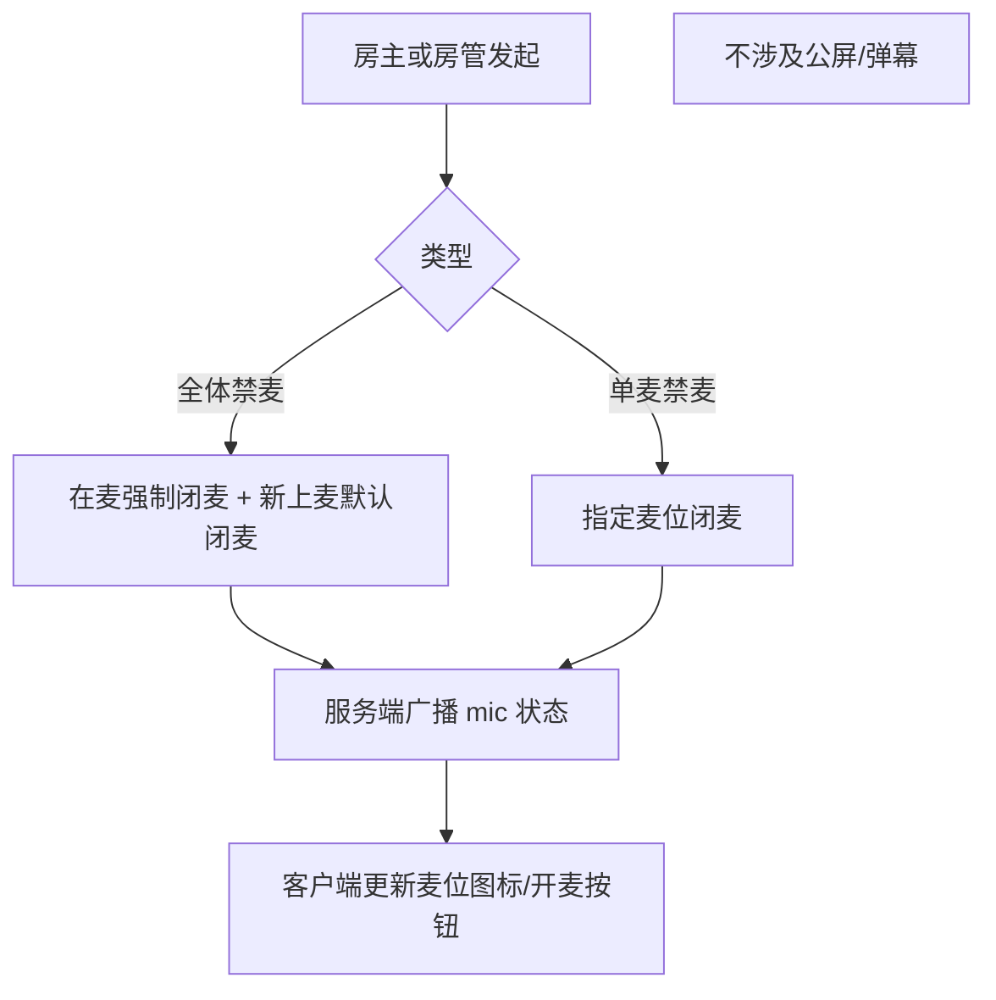

### 6.6 礼物打赏

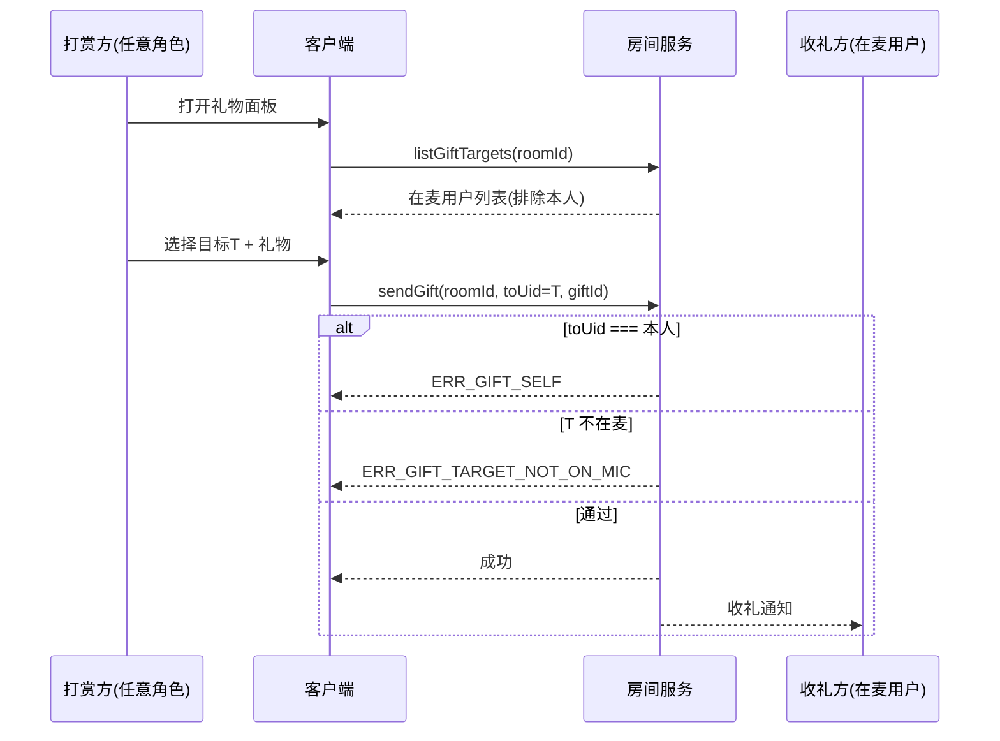

### 6.7 关闭麦位 vs 换位子

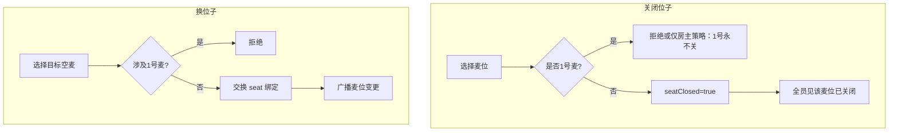

---

## 7. 麦位状态机

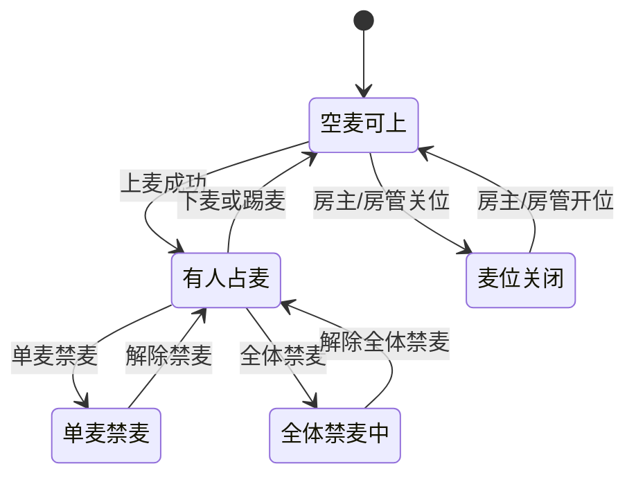

---

## 8. 能力对照表（速查）

| 能力 | 房主 | 房管 | 其他麦 | 观众 |
|------|:----:|:----:|:------:|:----:|
| 开麦/闭麦（自己） | ✓ | ✓ | ✓ | — |
| 开麦/闭麦（他人） | ✓ | ✓* | — | — |
| 踢麦（普通在麦） | ✓ | ✓ | — | — |
| 踢麦（房管） | ✓ | ✗ | — | — |
| 对房管：仅禁麦 | ✓ | ✓ | — | — |
| 下麦（自己） | ✓ | ✓ | ✓ | — |
| 全体禁麦 | ✓ | ✓ | — | — |
| 单麦禁麦 | ✓ | ✓* | — | — |
| 关闭位子 | ✓ | ✓* | — | — |
| 换位子 | —** | ✓* | ✓* | — |
| 设置/撤销房管 | ✓ | ✗ | — | — |
| 礼物打赏 | ✓ | ✓ | ✓ | ✓ |
| 打赏对象 | 麦上全员（不含自己） | 同左 | 同左 | 同左 |
| 关注 | ✓ | ✓ | ✓ | ✓ |
| 1号麦不可换 | 锁定 | 不可占 | 不可换入 | 不可申请 |

\* 不对 1 号麦 / 房主生效（建议）  
\*\* 房主本人不可离 1 号换位  
† 礼物：**全角色可打赏**；目标为 **所有在麦用户**；**不可打赏自己**

---

## 9. 边界与异常

| 场景 | 预期 |
|------|------|
| 房管尝试任免房管 | 拒绝，`ERR_NO_PERMISSION` |
| 房管尝试踢房管 | 拒绝；可改为 `muteMic` |
| 麦位已关闭时申请上麦 | `ERR_SEAT_CLOSED`，全员同文案 |
| 全体禁麦中开麦 | 按钮不可用，直至解除 |
| 被单麦禁麦且已上麦 | 保持闭麦，直至操作者解除 |
| 房管未上麦 | 与观众相同：无踢麦对象，可有房管菜单（若产品设计） |
| 打赏目标为自己 | 入口置灰或 `ERR_GIFT_SELF` |
| 打赏目标已下麦 | `ERR_GIFT_TARGET_NOT_ON_MIC` |

---

## 10. 核心 API 字段建议

| 接口 / 事件 | 字段建议 |
|-------------|----------|
| 进房 | `roomId`, `userId`, `role`: `owner` \| `admin` \| `guest` |
| 麦位 | `seatIndex`, `seatStatus`: `empty` \| `occupied` \| `closed`, `occupantUid` |
| 上麦/下麦/踢麦 | `action`: `join` \| `leave` \| `kick`, `targetUid`, `operatorUid`, `operatorRole` |
| 麦控 | `voiceOn`, `muteType`: `none` \| `self` \| `single_mic` \| `room_all_mic` |
| 房管 | `adminUids[]`, `setBy`（仅 owner）, `setAt` |
| 换位 | `fromSeat`, `toSeat`, `allowSeat1`: false |
| 礼物 | `sendGift(roomId, fromUid, toUid, giftId)`；`listGiftTargets` 返回在麦 uid 列表并 **排除 fromUid** |
| 错误码 | `ERR_SEAT_CLOSED`, `ERR_ROOM_MUTED`, `ERR_NO_PERMISSION`, `ERR_OWNER_IMMUTABLE`, `ERR_ADMIN_KICK_FORBIDDEN`, `ERR_GIFT_SELF`, `ERR_GIFT_TARGET_NOT_ON_MIC` |

---

## 11. 修订记录

| 版本 | 日期 | 说明 |
|------|------|------|
| v1.0 | 2026-05-28 | 初版：房管不可任免/踢房管；仅禁麦范围；修正权限图「独有」归属 |
| v1.1 | 2026-05-28 | 礼物打赏：全角色可对麦上全员打赏，不可打赏自己 |
